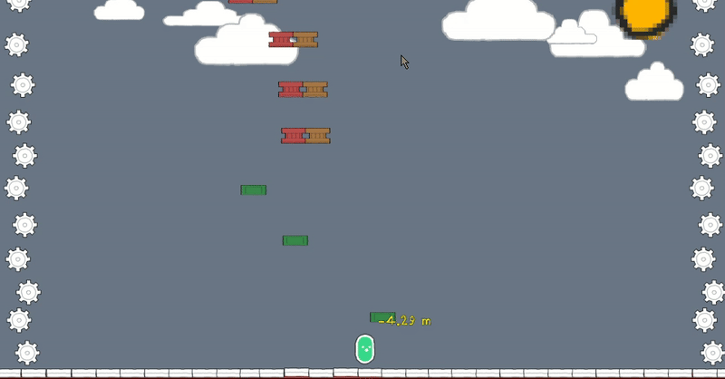

## Hi there 👋

<!--
**ReginalDLip/ReginalDLip** is a ✨ _special_ ✨ repository because its `README.md` (this file) appears on your GitHub profile.

Here are some ideas to get you started:

- 🔭 I’m currently working on ...
- 🌱 I’m currently learning ...
- 👯 I’m looking to collaborate on ...
- 🤔 I’m looking for help with ...
- 💬 Ask me about ...
- 📫 How to reach me: ...
- 😄 Pronouns: ...
- ⚡ Fun fact: ...
-->
#I'm currently a 5th-semester Computer Science student at BINUS University, specializing in Game Application and Technology (GAT). Over the past two semesters in this specialization, I've significantly improved my game development skills, primarily using Unity.

A little bit about myself: I'm driven by a strong curiosity for things I don't know yet, and I enjoy diving into hard and complex subjects.

Currently, I am expanding my skillset by participating in a Data Scientist program from the DBS Foundation. Through this, I aim to learn new technologies and broaden my future career paths beyond game development.

## Struggles
- Scripting
- Asset making (mostly 2d or pixel art assets)

## 🎯 Projects
- SahabatService: Marketplace untuk SDGs
- Firebase-integrated apps
- Crimson Exit (not finished)
- BlockShot
- SeaCleaner
- Haven't got the name for it

## Showcase 

| Crimson Exit  | BlockShot |
| :---: | :---: |
|  |  |
| *3D Hack and Slash Prototype* | *Topdown 2D Shooter Arcade* |
| [📂 View Repo](https://github.com/ReginalDLip/CrimsonDiner)   [ Play on Itch.io](https://jailip.itch.io/crimson-diner) | [📂 View Repo](https://github.com/ReginalDLip/BlockShot)   [ Play on Itch.io](https://jailip.itch.io/blockshot) |

| SeaCleaner | Infinite Vertical Jumper |
| :---: | :---: |
|  |  |
| *Educational Game about Ocean Cleaning* | *Infinite Jumper with Highscore System* |
| [📂 View Repo](https://github.com/ReginalDLip/SeaCleaner)   [ Play on Itch.io](https://jailip.itch.io/seacleaner) | [📂 View Repo](https://github.com/ReginalDLip/InfiniteCogs)   [ Play on Itch.io](https://jailip.itch.io/infinite-cogs) |

---

## 🔭 My Go-To Free Asset Stores

* [**kenney.nl**](https://kenney.nl) – Excellent free assets for 2D games and some 3D assets
* [**itch.io**](https://itch.io) – Find ONLY free game assets from the community (Credits will be written in the ReadMe project file)

---

📌 *Most of my projects are built with ************Unity************ and focus on gameplay mechanics and prototyping.*

